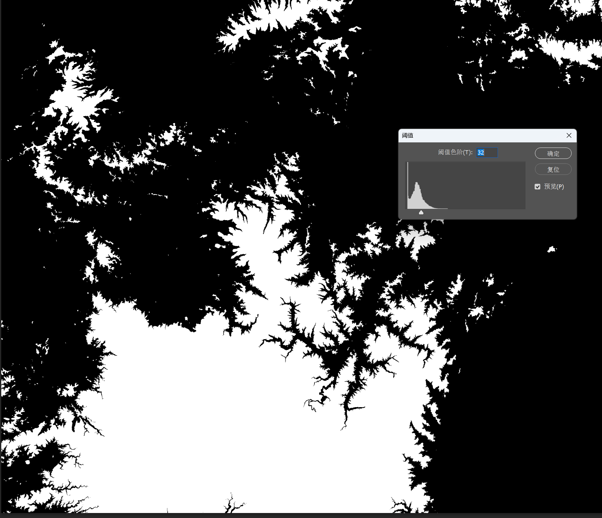
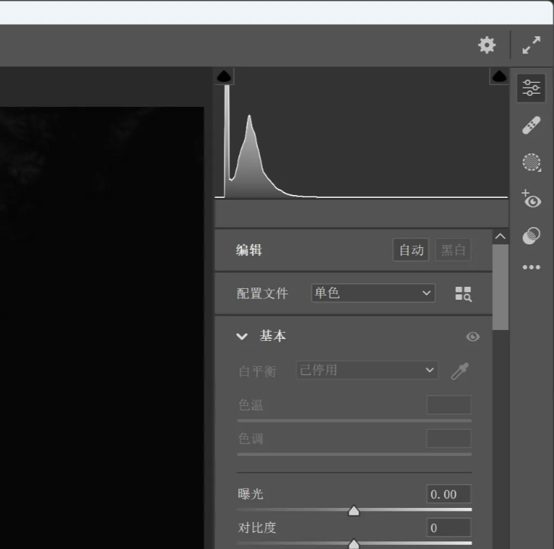

# 2025/11/25 一键使用ps将dem图（或者一切用明度来表示高度的图）转化为等高线风格

状态: 进行中

# 使用ps将dem图（或者一切用明度来表示高度的图）转化为等高线风格

### 思路：一个明度值对应一个高度，选取同一明度值并描边，重复此过程。

使用ps的“阈值”功能，原理是选择一个自己选择的明度值，画面中明度值比这个高的被归类为白，反之为黑。这个功能帮助获取不同明度（对应不同高度）的范围.接下来就是选区、描边，重复。

### 问题1：这样一步步操作半天只能生成一条等高线，我要画很多等高线
如何实现这一过程的自动化？类似脚本的功能？

查阅资料，发现ps的**“动作”**功能，点击录制按钮，它可以记录这段时间你在ps中的所有操作。
但！是！它只会记录，只能重复一样的操作，问题就来了：

### 问题2：怎么在每一次同样的操作下，完成对不同明度的选择？

按理来说，最直接的想法是每次改动“阈值”的值（生成一条等高线后，改变1点阈值，再生成下一条）
可是在“动作”功能下，系统只会重复你录入的固定动作，也就是“阈值”的值只能作为定量而不是变量。
这条工作流中，变量只有被操作的图层，由此我直接将图层作为变量x，每次循环都改变一次x的值。说人话就是循环一次——生成一条等高线，同时将dem的明度增加，这样就完成了阈值的相对调整。
以这样的思路，我编写了第一条动作循环。并且经过一些小问题的优化，完成了第一次（遇到第二次大问题之前的）输出实验。

### 问题3：问题接踵而至，观察输出结果，等高线的排布并不符合现实规律情况，疏密出现了问题（地形缓和的地方等高线应该稀疏），这是怎么回事？

单独观看长白山的等高线，一开始似乎还正常，越往后（越低）的时候，出现问题。从结果逆推，影响等高线的只有dem的黑白图像，一定是对明度值的修改出现了问题（因为其它都正常，只有明度的变化规律不对）
最后，观察dem的波形图，可以发现

*这是原dem的波形图

*这是调整“曝光”后的波形图

发现什么问题没有？波形发生了变换，这不是等比的变换，而是整个变样了
这就是原因所在，我错误的认为“曝光”效果是给全图均匀地增加相同点数的明度值，实际并非如此。

那么如何做到我想要的效果呢？答案是直接使用曲线工具调整

调整前后“几乎”没有区别，虽然仔细观察还是有一些变化，但至少相对先前的“曝光”效果来说，已经好非常多了

### 此方法的优势和劣势？

坏话说在前，劣势是

1. 使用ps对电脑性能要求较高，几回合下来我的64g内存都会爆
    
    
    
    *（此像素下大概运行80-100条等高线，就需要保存重新打开继续操作）
    
2. 等高线的真实性没有那么准确，没办法精确到每一条等高线对应海拔多少米
3. 没了

好处：

1. **极高的可自定义度**
每一条等高线图层可单独修改。同时通过添加调整步骤，可以实现很多效果，就像代码，
例：我想要等高线每5条有一条粗，呈现 “粗-细-细-细-细”的分布只需要在每4次循环运行后让第五次的线条变粗就行。等等等等

2.（待验证）配合blender出图，将dem灰度图贴到3d模型上，可以直接**实现立体图像的等高线效果**，原理和平面图是一样的，不过待实验验证。绕过了blender切等高线乱线的问题。

3.**快，方便**。只需导出dem的黑白图像，导入ps，点击运行步骤，接下来就交给电脑。
