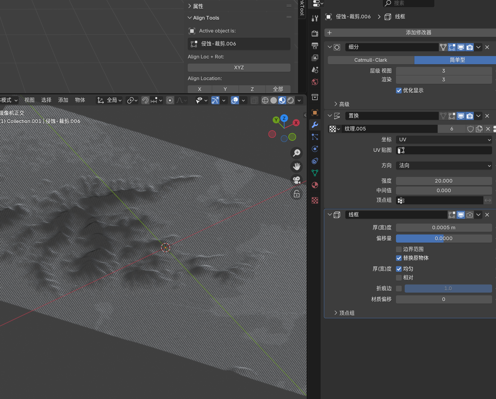
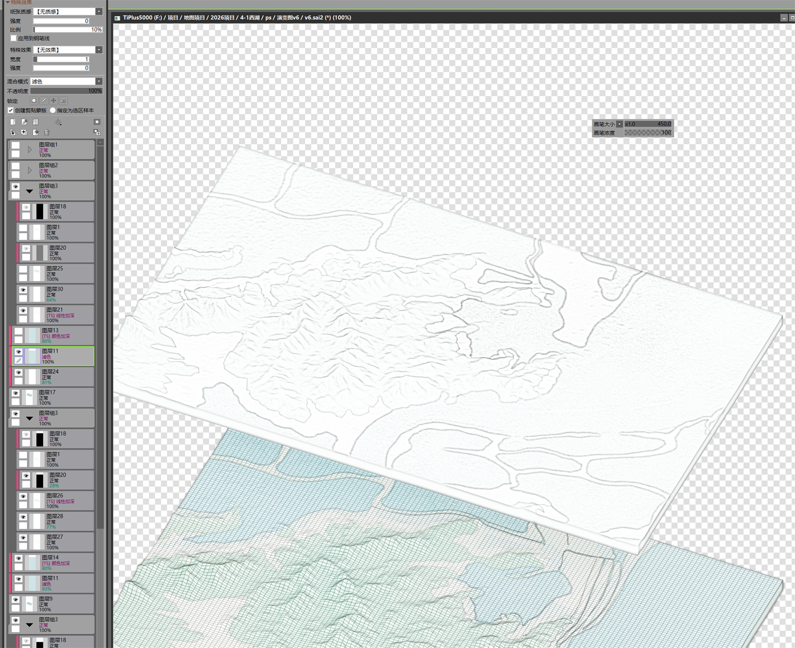
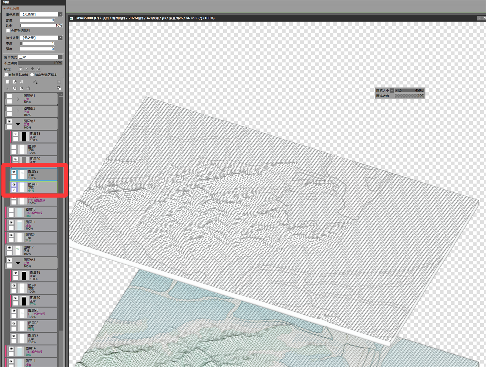
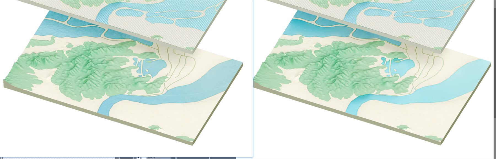
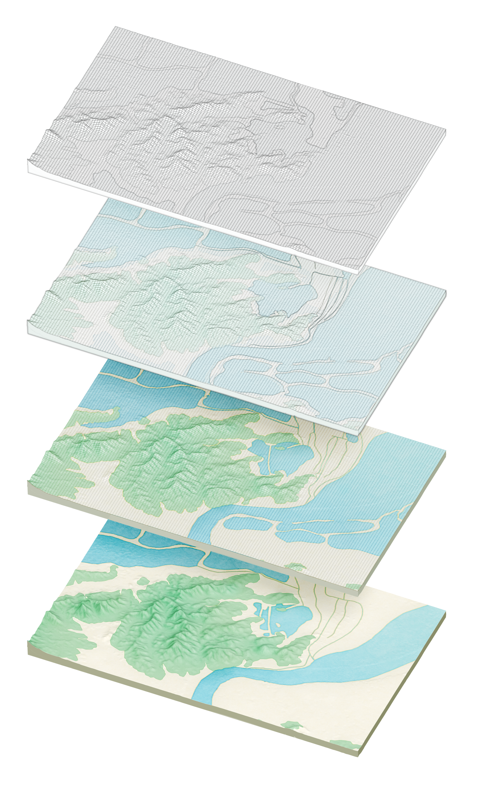
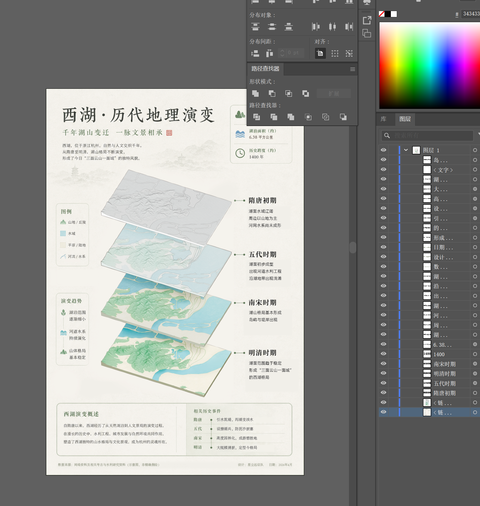
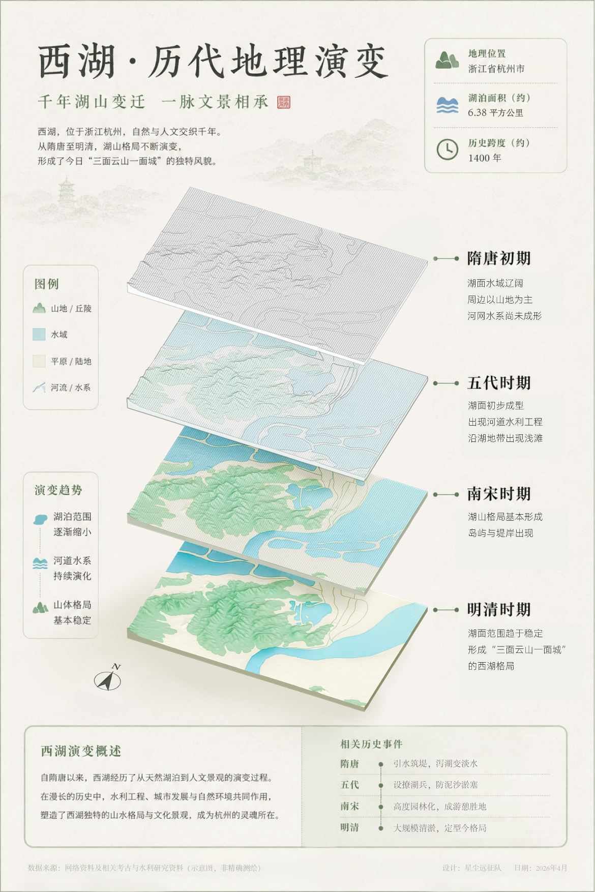

---
title: "2026/4/29"
date: "2026-05-12"
status: "进行中"
tags: "weekly-report"
---
# 2026/4/29

状态: 未开始

本周任务：继续优化

**上次的问题**：每张图片过于相似，需要在视觉上区分

思路：1：色彩上（明度、饱和度上渐进）2：材质上做出区别

材质上：

↑ 使用网格+进行材质融合

↑ ps中提取线稿，适当加强西湖周边区域线条的存在感。

↑ 与网格材质叠加，保留区域划分形状的同时可以增加材质（线框）感

优化了水的质感

### 最终效果展示

ai辅助排版，人工检查修改润色

