---
title: "2026/5/15江南山水图"
date: "2026-05-20"
status: "进行中"
tags: "地图作品，ai辅助，工作流"
---
# 2026/5/15江南山水图

状态: 完成

探索ai辅助制作信息图的工作流

# 一：使用gis+blender的方式生成地理底图

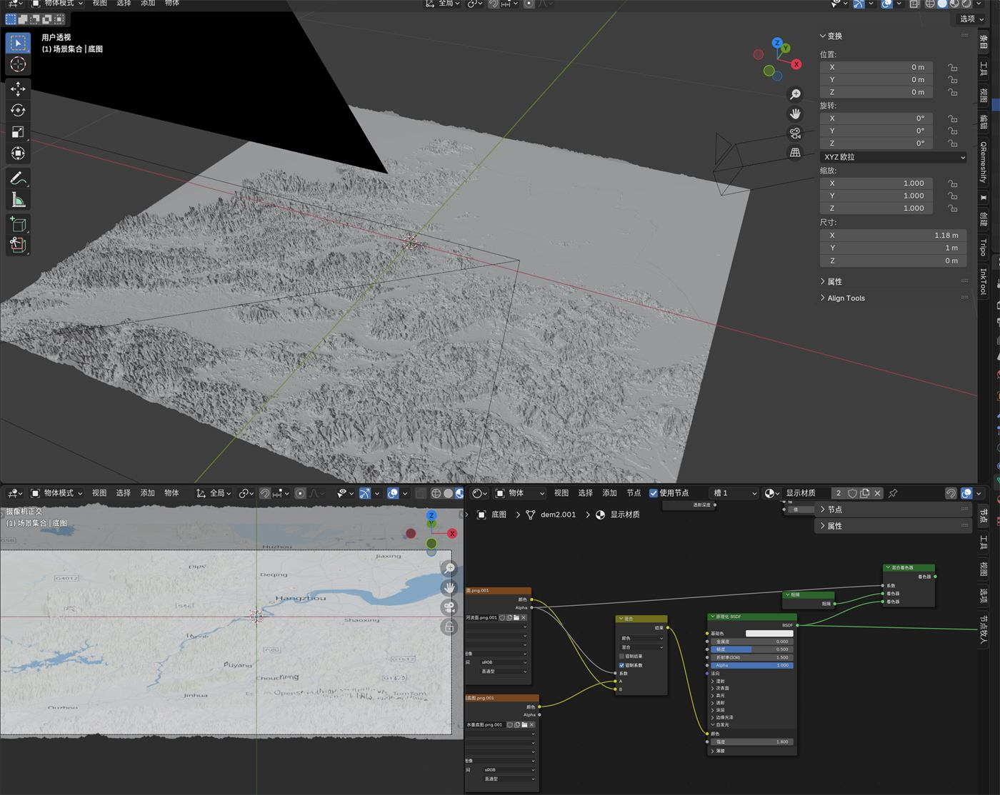

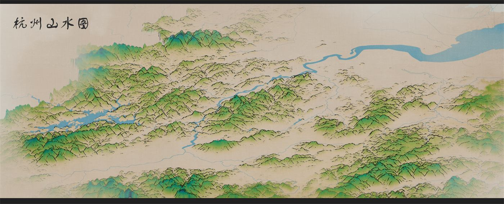

版本1👆

[https://www.notion.so](https://www.notion.so)

# 二：借助ai进行低成本风格探索与排版

觉得原版本过于“浓郁”，尝试让ai（image-2）生成更清爽的方案尝试

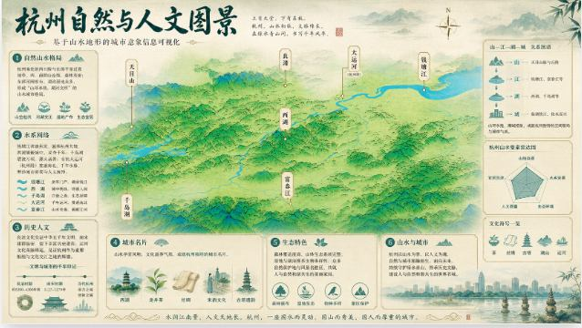

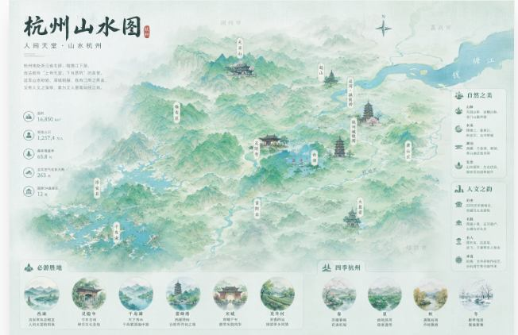

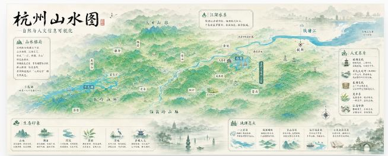

最后觉得图3的风格效果不错，在此基础上进行调色细化

# 三：在ai生成图片的方向上做进一步排版、调色细化

#### 版本1

#### 版本2

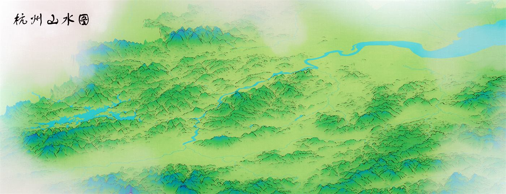

#### 版本3（最终版本）

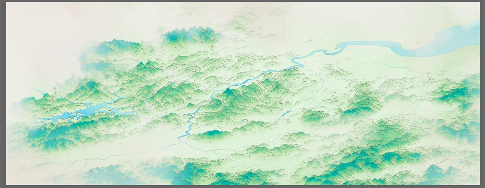

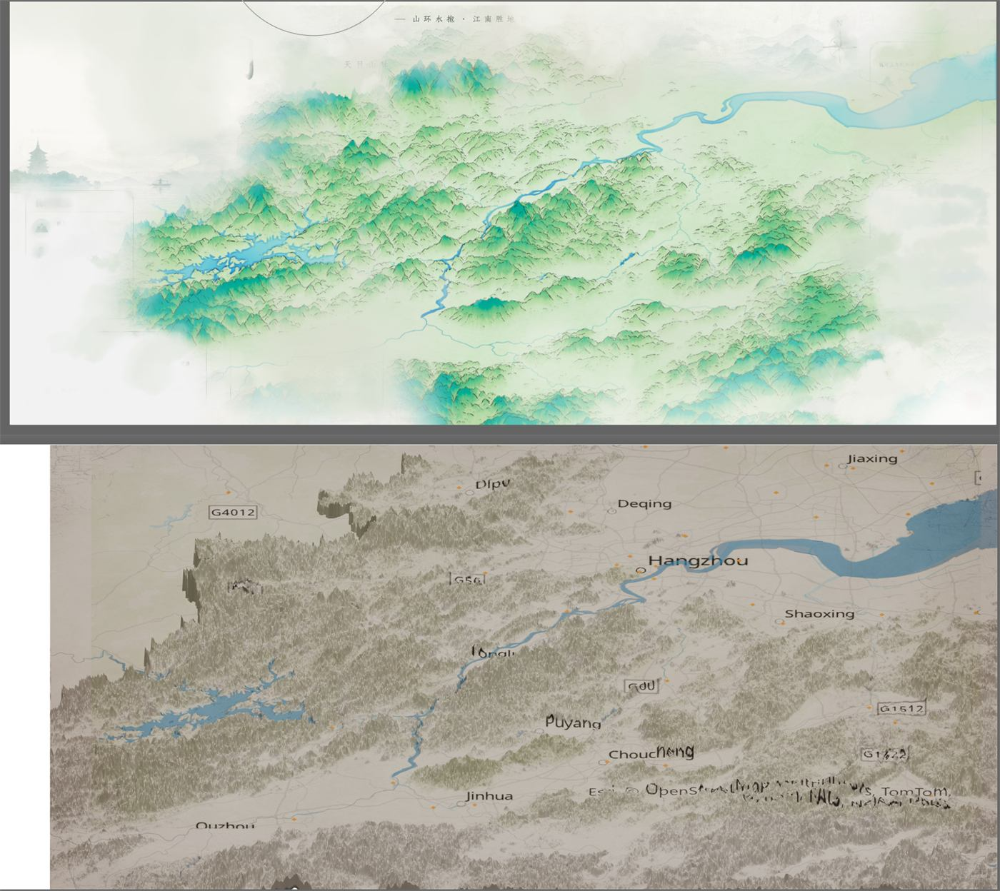

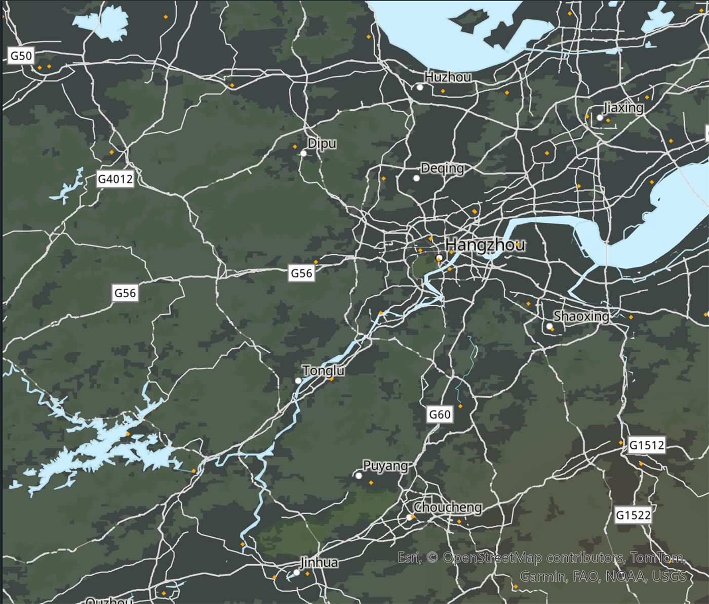

ai生成4k图层标注素材

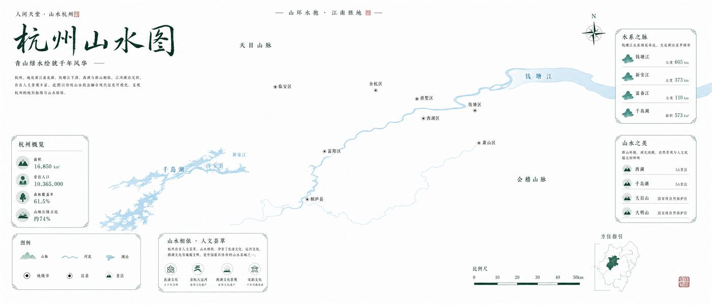

## 人工数据标注审查，确保数据准确性

# 半成品👇

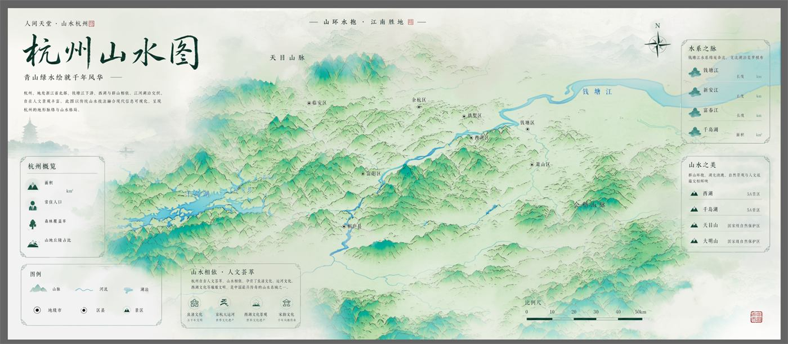

# 2026/5/20更新

完成作品

### 1：材质优化

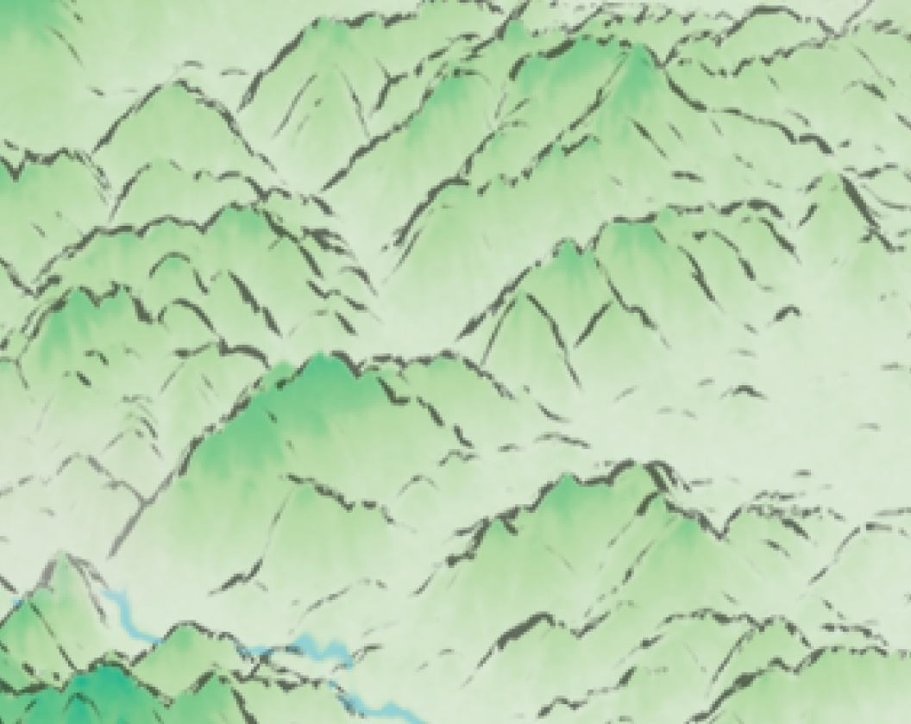

优化前

### 2：标注内容审核

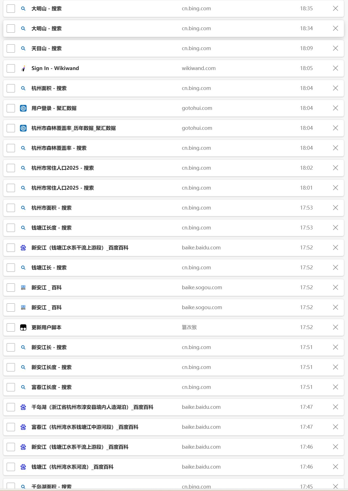

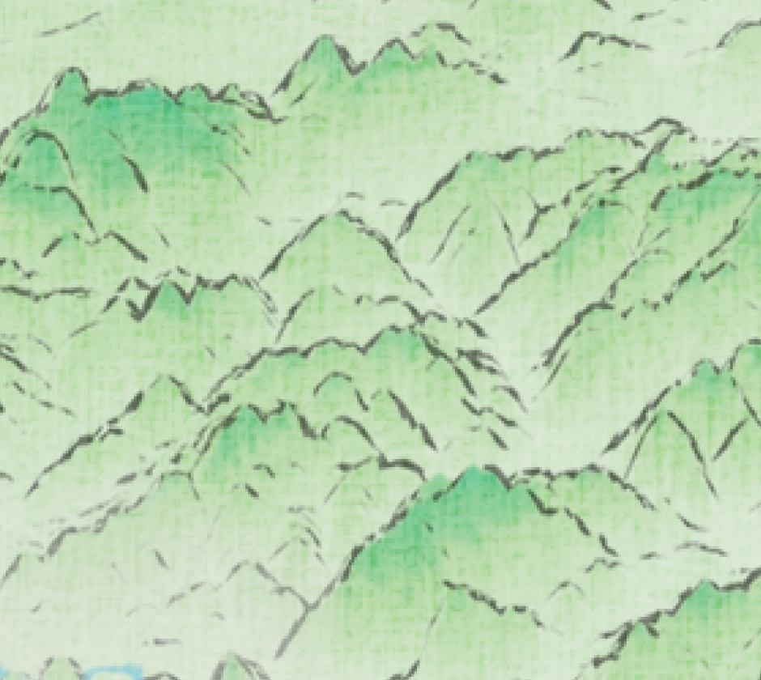

优化后，增加纸张纹理

# 最终成图

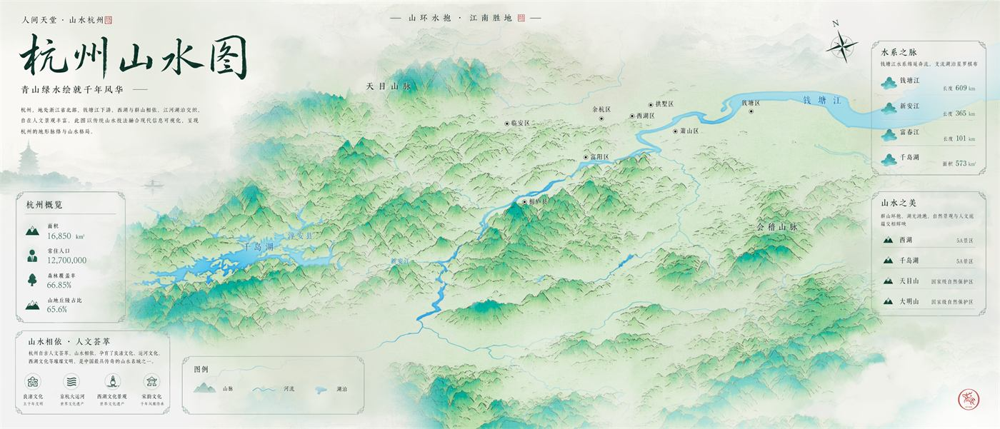
