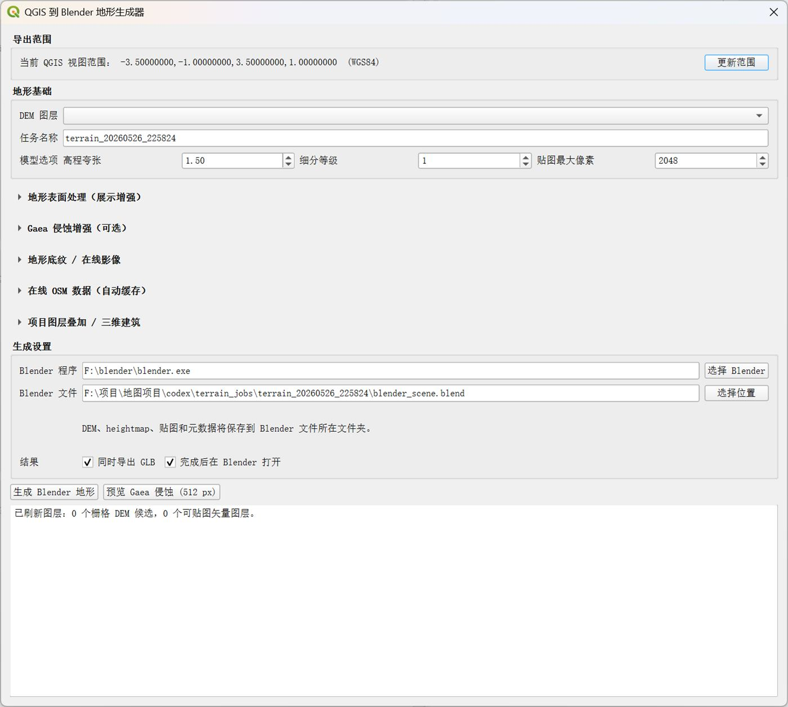
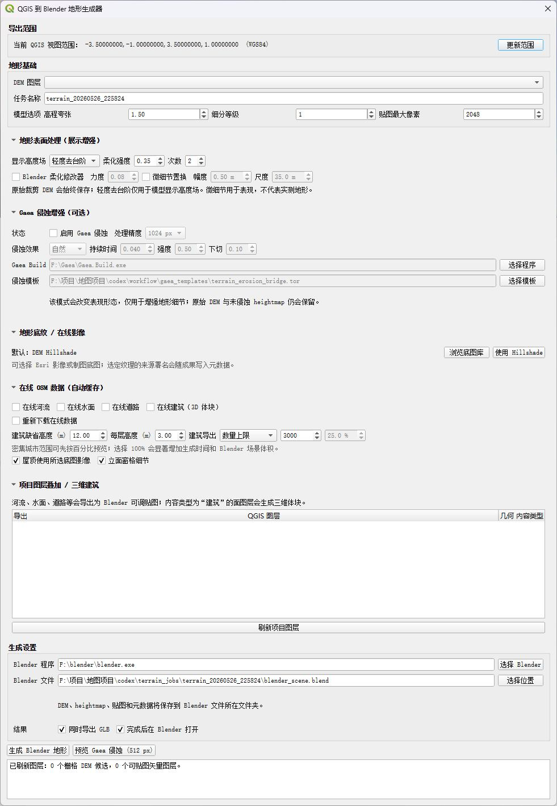
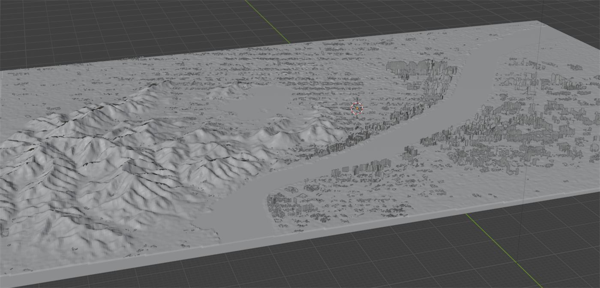
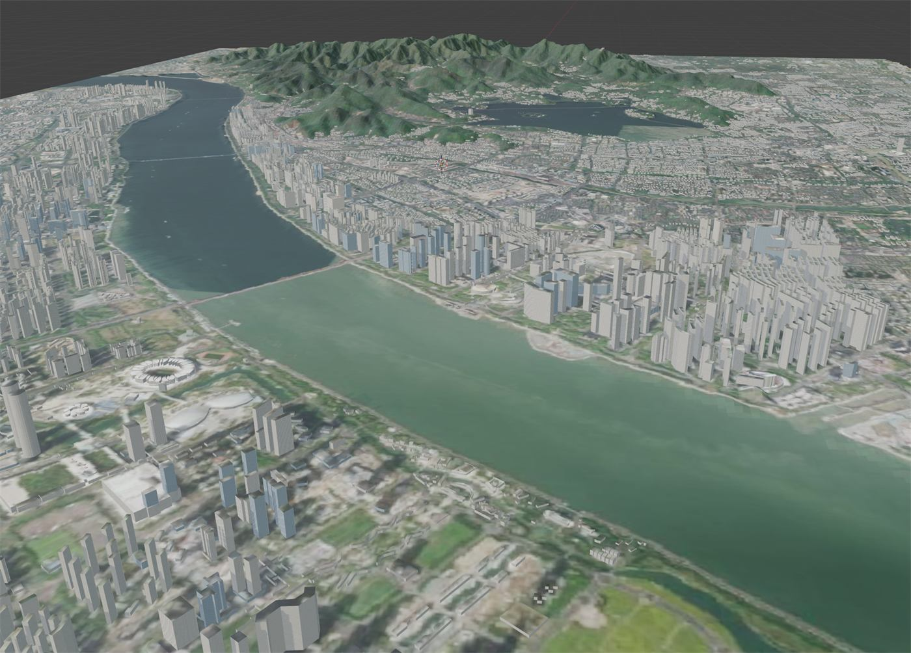

---
title: "2026-5-26 工作流效率优化"
date: "2026-05-26"
status: "进行中"
tags: "工作流，qgis插件，效率提升"
---
# 2026-5-26 工作流效率优化

状态: 未开始

# 设计了一个qgis插件，大幅度提升地理模型制作的效率

## 以往的地理模型搭建需要

1. 下载需要制作地区的各种数据（dem、全球影像、河流、道路）等
2. 导入到qgis中，框选范围，分图层进行一个个设置导出
3. （可选）dem导入到gaea、photoshop做优化处理
4. 在blender中使用置换修改器搭建模型，贴图、修改参数

**从头开始搭建一个模型需要数个小时的工作**

## 现在：选择好范围，**一键导出**到blender

项目优点：

1. **工作流完整，真正串联了 GIS 到三维成果**
    
    项目打通了 **QGIS -> DEM/影像/OSM 导出 -> 可选 Gaea 增强 -> Blender 场景生成** 的完整路径。用户最终能获得 .blend、高度图、贴图、DEM 和元数据，而不是若干彼此割裂的中间脚本。
    
2. **非常重视非程序用户体验**
    
    以 QGIS 当前视图作为范围、通过窗口选择数据和参数、成果统一输出到指定目录，避免了手写 JSON 和控制台操作。复杂选项默认折叠，也说明界面设计在控制信息负担。
    
3. **关键设计取舍务实**
    
    项目没有盲目追求“全部三维化”：河流和道路选择材质叠加而不是管状三维线；航片只适合屋顶而不强行作为立面纹理；Gaea 被明确定位为视觉增强而不取代真实高程。这些判断符合数据属性，也能减少错误表现。
    
4. **保留真实性，同时支持视觉提升**
    
    原始 clipped_dem.tif 会保留，而柔化高度场、Blender 修改器和 Gaea 侵蚀都是可选增强。这让项目既可用于可信的地形基础，也可用于更好看的展示或场景制作。
    
5. **建筑生成兼顾细节与性能**
    
    OSM 建筑不仅可以按高度生成体块，还支持屋顶影像和程序化立面。更重要的是，项目已经设计了“数量上限”和“范围内百分比抽样”两种控制方式，适合应对城市范围中数万栋建筑的性能压力。
    
6. **在线数据处理考虑了效率**
    
    OSM 河流、水面、道路和建筑都能按范围下载，并且复用相同范围、相同类型的数据缓存，还允许手动重新下载。这对反复调整场景的工作流很有价值。
    
7. **Gaea 集成方式很适合迭代创作**
    
    支持多档侵蚀强度、自定义参数，并提供 512 px 的低成本预览，不必每次都启动 Blender 做完整生成。这个预览与正式输出分离的设计，能明显提升调参效率。
    
8. **模块拆分较清晰，具备继续扩展的基础**
    
    界面调度、QGIS 导出、Blender 建模、OSM 下载、Gaea 衔接、配置与数据目录均有独立模块。这种结构便于以后增加建筑样式、更多底图来源、发布打包和路径配置。
    

